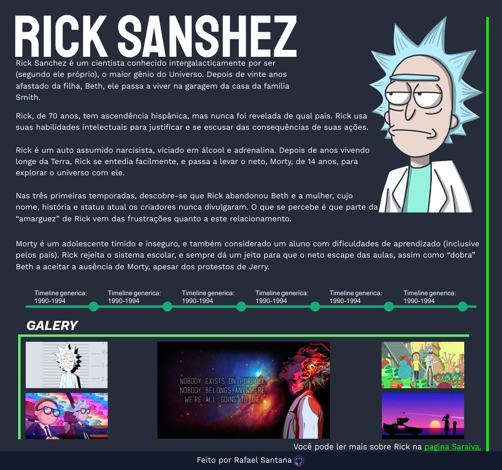

# Tribute Page Project

## Projeto página de tributo simples em HTML 5 e CSS3

&nbsp;

**Técnicas usadas:**

* **Kanban** - Usado para administrar todo o projeto.
* **Pomodoro** - Usado para gestão de tempo aumentando a produtividade e diminuindo o desgaste do desenvolvedor.

&nbsp;

**Ferramentas e tecnologias usadas:**

* **CorelDraw** - Criação do layout.
* **HTML5 e CSS3** - Estrutura semântica da página e estilização .
* **VS Code** - editor de texto/IDE.
* **Git** - versionador do projeto.
* **GNU/Linux Ubuntu 20.04 LTS** - Repositório local virtualizado em modo terminal usando WSL2 (Subsistema Windows para Linux).
* **Github** - repositório remoto.

&nbsp;

### *Layout feito no CorelDraw de como a página deve se parecer.*

